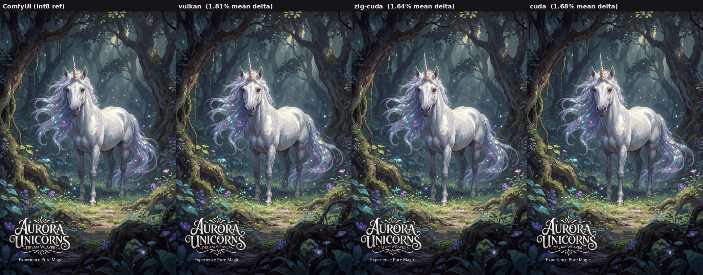

## TensorPencil

**This is an experimental work in progress.**

TensorPencil is a test to see how far we can push diffusion performance in pure Zig (aside from Vulkan / CUDA libraries).

It currently targets FP8 and INT8/INT4 ConvRot Krea 2, and those are the only models that have been tested.
I made up the INT4 format because I was curious, so you won't be able to find any INT4 ConvRot models. Sorry.


### AI Disclaimer
TensorPencil is heavily AI-assisted code. Most of this stuff is over my head, I'm just tinkering here.
The exception is this readme; I'm of the opinion that if you expect a human to take the time to read something, you should take the time to write it.

## Details

Backends supported so far:
- CPU - baseline reference, very slow (`--backend cpu`)
- Vulkan - Zig hand-emitted SPIR-V (`--backend vulkan`)
- Zig PTX (CUDA) - pure-Zig hand-emitted PTX (`--backend zig-cuda`)
- CUDA libraries - NVIDIA cuBLASLt + cuDNN (`--backend cuda`)

The backends all make images nearly pixel-identical to ComfyUI; here is a comparison image across the three GPU
backends vs. a ComfyUI reference.



The goal is for 100% Zig code other than needed 3rd party libraries for Vulkan and CUDA.
The CPU, Vulkan, and Zig-PTX backends stick to that pretty well: the drivers for Vulkan
and CUDA are dlopen'd (they need to be installed). The `cuda` backend dlopen's NVIDIA's 
closed-source math libraries (`libcublasLt.so`, `libcudnn.so`) and uses some C interop
code to interact with them, so it's the least pure backend, but also the fastest.

This has been tested only on Linux with an RTX 3090 and RTX 4090. It's likely that other
operating systems and GPUs will hit problems or run less efficiently.

Not all backends support all model formats yet.

| Model format | `cpu` | `vulkan` | `zig-cuda` | `cuda` |
|:-------------|:-----:|:--------:|:----------:|:------:|
| FP8          |   ✅   |    ✅     |     ❌      |   ❌    |
| INT8 ConvRot |   ✅   |    ✅     |     ✅      |   ✅    |
| INT4 ConvRot |   ✅   |    ❌     |     ✅      |   ✅    |

Speeds vary widely depending on the model format and backend used. This table is from an RTX
3090 / Ryzen 7 9800X3D generating a 4 step 1024x1024 cfg 1 image with full VRAM availability,
across the different formats and backends.

| Model format | `cpu` | `vulkan` | `zig-cuda` | `cuda` | ComfyUI w/CUDA |
|:-------------|:-----:|:--------:|:----------:|:------:|:--------------:|
| FP8          |  288  |   2.89   |     —      |   —    |      2.46      |
| INT8 ConvRot |  289  |   2.39   |    1.94    |  1.28  |      1.14      |
| INT4 ConvRot |  287  |    —     |    1.38    |  1.11  |       —        |

Plans for the future:
- ???

## Running it

Requires Zig 0.16.0. There are no build-time C dependencies; all runtime libraries are
opened dynamically (`dlopen`) and only for the backend that needs them — the CPU path
needs nothing:
- `--backend vulkan` → `libvulkan.so.1` (Vulkan loader)
- `--backend zig-cuda` → `libcuda.so.1` (CUDA driver — for the hand-emitted PTX)
- `--backend cuda` → `libcuda.so.1` + `libcublasLt.so` + `libcudnn.so.9` (NVIDIA's
  math libraries; install cuDNN 9 + the CUDA 12/13 toolkit runtime)

You'll also need a driver for your GPU. On Ubuntu:

```
sudo apt install libvulkan1
```

plus a driver: the NVIDIA proprietary driver (e.g. `sudo apt install nvidia-driver-580`)
already includes its Vulkan ICD.

Build with optimizations on (Debug is painfully slow for numeric code):

```
zig build -Doptimize=ReleaseFast
```

Model weights are not included. You will need a Krea 2 model in fp8/int8/int4 format, along
with Qwen 3 VL 4b and Wan 2.2 VAE. Then:

```
zig-out/bin/TensorPencil generate --prompt "a fluffy orange cat sitting on a windowsill" --dit /path/to/krea2.safetensors --text-encoder /path/to/qwen3VL.safetensors --vae /path/to/vae.safetensors --backend vulkan --out cat.png
```

Run with no command to see the available options and defaults.

### VRAM offloading

When running on GPU, if other processes are using vram or the `--vram-budget` option is set,
weights past the available budget are streamed from the mmapped file. Assuming sufficient RAM for cache,
this streaming costs only ~20% per step and stays roughly flat across cap sizes — below full residency
effectively every weight re-uploads each step, so a smaller cap is barely slower (see the chart below).
You can pass `min` as the budget size to load only 2 weights at a time, ~150MiB (~40% performance loss per step).

** Note that the VRAM budget is only for the weights, the scores and activations are still in VRAM.**
The amount of VRAM used for the scores and activations depends on the size of the image; at ~1.8MP, it will 
be roughly 3.1GiB; this also varies by backend.

Measured on an RTX 3090 at 1120×1680, 4 steps, INT8 ConvRot, vulkan backend:

| VRAM cap                    | s/step | total  |
|:----------------------------|:-------|:-------|
| 0 (driver-managed, default) | 5.25   | 26.4 s |
| 16 GiB                      | 6.39   | 31.0 s |
| 12 GiB                      | 6.45   | 31.1 s |
| 8 GiB                       | 6.46   | 31.1 s |
| 6 GiB                       | 6.42   | 30.9 s |
| 4 GiB                       | 6.33   | 30.5 s |
| 2 GiB                       | 6.47   | 31.2 s |
| 1 GiB                       | 6.53   | 31.3 s |
| min (150MiB)                | 7.21   | 34.2 s |

### LLM

Added another executable that processes LLM models, for fun: `tp-llm`. Only tested with the already-used Qwen 3 VL 4b
text encoder model (embedded tables) and now supports gguf models and qwen 3.6 27b, with vision.

Can run in single-response mode if you specify `--prompt <prompt>`, or runs in REPL (conversation) mode if you skip
the prompt. In REPL mode, type `/exit` to exit. Runs on all four backends:

| Backend  | tok/s |
|:---------|:------|
| cpu      | 2.9   |
| vulkan   | 26.5  |
| zig-cuda | 67    |
| cuda     | 69    |

Run the command without arguments to see the usage. Example usage:

`tp-llm --model qwen-3-vl-4b.safetensors --prompt "why is the sky blue" --backend zig-cuda`

LLM mode also has some types of speculative decoding and VRAM offloading.