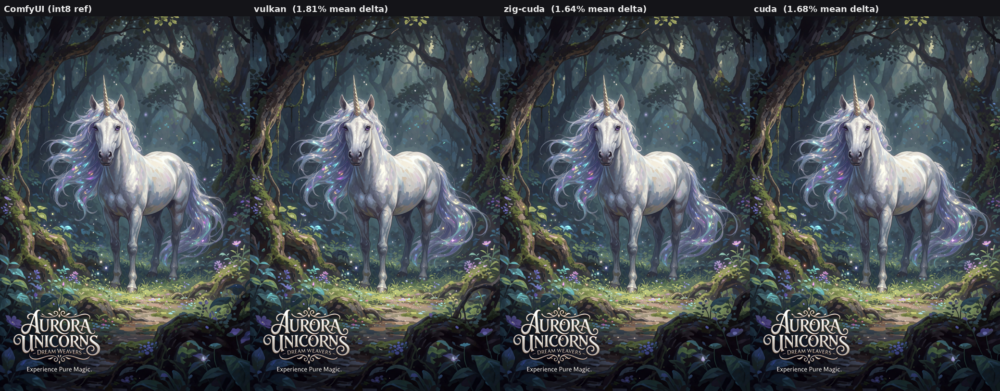

## TensorPencil

**This is an experimental work in progress.**

TensorPencil is about running inference backed by Zig so we have better control over memory.

On the diffusion side it runs six model families — Krea 2, SD 1.5, SDXL, Z-Image, Anima and
SenseNova U1.5 — in safetensors or GGUF. The family is detected from the checkpoint's own
tensor names, so there is no flag to get wrong. Weights can be fp8, bf16, int8/int4 ConvRot,
W4A8, NVFP4 or GGUF block quants; not every format runs on every backend (see `BACKEND.md`).

For LLM side, it works with Qwen 3/3.5/3.6/3.8, K2 Horizon, Gemma 3 and Gemma 4, Bonsai, and
Mistral/llama-architecture models, with vision where the model has it. LLMs are only tested
in GGUF (the exception is the Krea 2 text encoder, which is safetensors).

There are three executables: `TensorPencil` (the diffusion CLI), `tp-llm` (the LLM CLI) and
`tp-gui` (a desktop app that does both).

### AI Disclaimer
TensorPencil is heavily AI-assisted code. Most of this stuff is over my head, I'm just tinkering here.
The exception is this readme; I'm of the opinion that if you expect a human to take the time to read something, you should take the time to write it.

## Details

Backends supported so far:
- CPU - baseline reference, very slow (`--backend cpu`)
- Vulkan - Zig SPIR-V (`--backend vulkan`)
- Zig PTX (CUDA) - Zig hand-emitted PTX (`--backend zig-cuda`)
- CUDA libraries - NVIDIA cuBLASLt + cuDNN (`--backend cuda`)

Would like to eventually support:
- Metal - Apple MLX (`--backend metal`) (I don't have a Mac)
- ROCm libraries - AMD ROCm equivilant to cuBLASLt etc. if there is one (`--backend rocm`)
- Intel libraries - Intel oneAPI equivilant to cuBLASLt etc. if there is one (`--backend intel`) (I don't have an Intel GPU)

The backends all make images nearly pixel-identical to ComfyUI; here is a comparison image across the three GPU
backends vs. a ComfyUI reference.



This has been tested on Linux with an RTX 3090 and RTX 4090, and the Vulkan backend on an
Intel Arc A310. Other operating systems and GPUs will hit problems or run less efficiently.
Two known limits: the PTX is built for one CUDA compute capability at a time (`-Dcuda-sm`,
default 86, so pre-Ampere cards will not JIT it), and the AMD paths are written but untested.

Not all backends support all model formats yet. The full grid is in `BACKEND.md`; the short
version for diffusion weights:

| Model format      | `cpu` | `vulkan` | `zig-cuda` | `cuda` |
|:------------------|:-----:|:--------:|:----------:|:------:|
| FP8               |   ✅   |    ✅     |     ✅      |   ✅    |
| BF16              |   ✅   |    ✅     |     ✅      |   ✅    |
| INT8 ConvRot      |   ✅   |    ✅     |     ✅      |   ✅    |
| INT4 ConvRot      |   ✅   |    ✅     |     ✅      |   ✅    |
| W4A8 / NVFP4      |   ✅   |    ✅     |     ✅      |   ✅    |
| GGUF block quants |   ✅   |    ❌     |     ✅      |   ✅    |

Speeds vary widely depending on the model format and backend used. This table is from an RTX
3090 / Ryzen 7 9800X3D generating a 1024x1024 cfg 1 image with full VRAM availability,
across the different formats and backends. Numbers are seconds per step.

| Model format | `cpu` | `vulkan` | `zig-cuda` | `cuda` | ComfyUI w/CUDA |
|:-------------|:-----:|:--------:|:----------:|:------:|:--------------:|
| FP8          |  288  |   2.89   |     —      |   —    |      2.22      |
| INT8 ConvRot |  289  |   2.39   |    1.90    |  1.24  |      1.04      |
| INT4 ConvRot |  287  |    —     |    1.38    |  1.11  |      0.74      |

Plans for the future:
- Unclear, but I keep finding more things to add

## Running it

Requires Zig 0.16.0 and a few system C libraries. `zig build` (the two CLIs) needs:

- **libvips** — image decode for `tp-llm`'s `--image` / `@mentions`
- **libavformat / libavcodec / libavutil / libswscale / libswresample** (ffmpeg) — clip
  muxing in the diffusion CLI
- **pkg-config**, which is how the build finds both

`zig build gui` additionally needs **X11, Xcursor, Xi and wayland-client** for SDL3.

On Debian/Ubuntu:

```
sudo apt install pkg-config libvips-dev libavformat-dev libavcodec-dev libavutil-dev \
                 libswscale-dev libswresample-dev
sudo apt install libx11-dev libxcursor-dev libxi-dev libwayland-dev   # for tp-gui
```

On Arch: `pacman -S pkgconf libvips ffmpeg` (plus `libx11 libxcursor libxi wayland` for the
GUI).

ggml, dvui/SDL3 and known-folders are Zig package dependencies and are fetched automatically
on compile. ggml can be turned off with `-Dggml=false`, which costs the GGUF block-quant
dtypes.

If your distro is new enough to ship gcc 16 / recent binutils (Arch, CachyOS), Zig 0.16's ELF
linker cannot process the `.sframe` relocations in its crt startup objects and every
libc-linked build fails. Run `tools/patch-crt.sh` once; the build picks up the patched crt
automatically after that.

Backends other than `cpu` require additional runtime libraries:

- `--backend vulkan` → `libvulkan.so.1` (Vulkan loader)
- `--backend zig-cuda` → `libcuda.so.1` (CUDA driver — for the hand-emitted PTX)
- `--backend cuda` → `libcuda.so.1` + `libcublasLt.so` + `libcudnn.so.9` (NVIDIA's
  math libraries; install cuDNN 9 + the CUDA 12/13 toolkit runtime)

You'll also need a Vulkan driver for your GPU for the Vulkan backend. On Ubuntu:

```
sudo apt install libvulkan1
```

plus a driver: the NVIDIA proprietary driver (e.g. `sudo apt install nvidia-driver-580`)
already includes its Vulkan ICD.

Build with optimizations on (Debug is painfully slow for numeric code):

```
zig build -Doptimize=ReleaseFast
```

Model weights are not included. What you need depends on the family: a bundled SD1.5 or SDXL
checkpoint carries its text encoder and VAE inside it, while Krea 2 wants a separate Qwen 3
VL 4b text encoder and a Wan 2.1 VAE. Anything the primary checkpoint doesn't carry is given
with `--text-encoder` / `--vae`. For example:

```
zig-out/bin/TensorPencil generate --prompt "a fluffy orange cat sitting on a windowsill" --dit /path/to/krea2.safetensors --text-encoder /path/to/qwen3VL.safetensors --vae /path/to/vae.safetensors --backend vulkan --out cat.png
```

Run with no command to see the available options and defaults.

### GUI

`zig build gui` builds `tp-gui`, a desktop app (dvui + SDL3) that runs chat and image
generation together: models are picked from folders you point it at rather than typed as
paths, and the two sides share one VRAM budget. `zig build run-gui` builds and runs it.

### VRAM offloading

When running on GPU, if other processes are using vram or the `--vram-budget` option is set,
weights past the available budget are streamed from the mmapped file. Assuming sufficient RAM for cache,
this streaming costs only ~20% per step and stays roughly flat across cap sizes — below full residency
effectively every weight re-uploads each step, so a smaller cap is barely slower (see the chart below).
You can pass `min` as the budget size to load only 2 weights at a time, ~150MiB (~40% performance loss per step).

** Note that the VRAM budget is only for the weights, the scores and activations are still in VRAM.**
The amount of VRAM used for the scores and activations depends on the size of the image; at ~1.8MP, it will 
be roughly 3.1GiB; this also varies by backend and prompt.

Measured on an RTX 3090 at 1120×1680, 4 steps, INT8 ConvRot, vulkan backend:

| VRAM cap                    | s/step | total  |
|:----------------------------|:-------|:-------|
| 0 (driver-managed, default) | 5.25   | 26.4 s |
| 16 GiB                      | 6.39   | 31.0 s |
| 12 GiB                      | 6.45   | 31.1 s |
| 8 GiB                       | 6.46   | 31.1 s |
| 6 GiB                       | 6.42   | 30.9 s |
| 4 GiB                       | 6.33   | 30.5 s |
| 2 GiB                       | 6.47   | 31.2 s |
| 1 GiB                       | 6.53   | 31.3 s |
| min (150MiB)                | 7.21   | 34.2 s |

NOTE: this has changed quite a bit since I wrote this, the speed numbers need to be updated and the minimum size may be different.

### LLM

Added another executable that processes LLM models, for fun: `tp-llm`. It started with the
already-used Qwen 3 VL 4b text encoder model (embedded tables) and now covers GGUF models
across the Qwen 3.x, Gemma 3/4, llama/Mistral and K2 Horizon architectures, with vision.

Can run in single-response mode if you specify `--prompt <prompt>`, or runs in REPL (conversation) mode if you skip
the prompt. In REPL mode, type `/exit` to exit. Most models run on all four backends; K2 Horizon runs on CPU and CUDA. Qwen 3 VL 4b:

| Backend  | tok/s |
|:---------|:------|
| cpu      | 2.9   |
| vulkan   | 26.5  |
| zig-cuda | 67    |
| cuda     | 69    |

Run the command without arguments to see the usage. Example usage:

`tp-llm --model qwen-3-vl-4b.safetensors --prompt "why is the sky blue" --backend zig-cuda`

K2 Horizon supports `--reasoning-effort high|medium|low`. Its CUDA path keeps fixed weights resident and streams the routed MoE/MoVA experts:

`tp-llm --model K2-Horizon-MoVA-36B-A4B-Q6_K.gguf --prompt "why is the sky blue" --backend zig-cuda --reasoning-effort medium`

LLM mode also has some types of speculative decoding and VRAM offloading.
