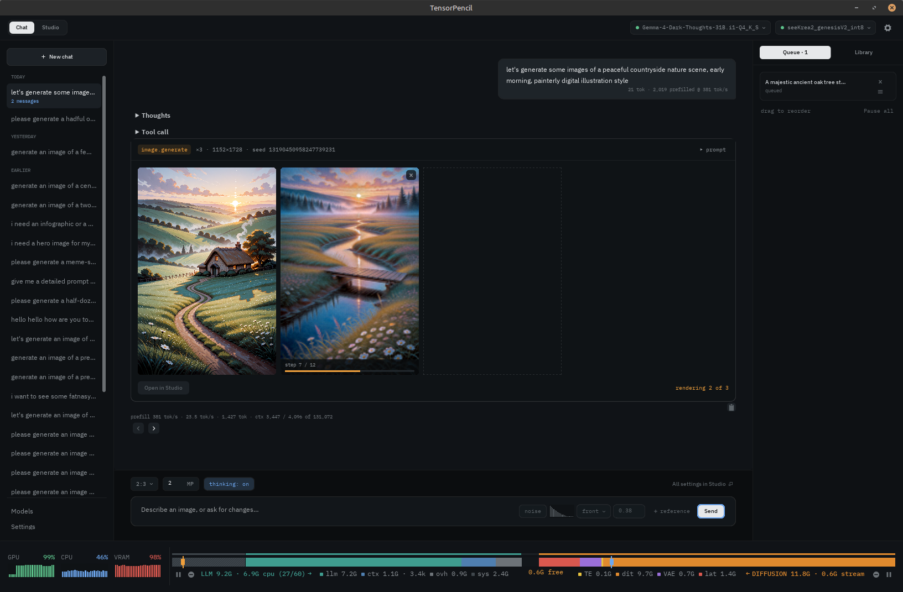

## TensorPencil

**This is an early Alpha-level program. Expect warts, crashes, frequent large changes, and bugs.**

TensorPencil is about running local token generation and diffusion models with having to faff about
with virtual environments or Python versions or Tensorflow or any of that stuff.

TensorPencil consists of several parts:

* The code itself is organized as a library so it can be easily included in other Zig programs,
or compiled into a C compatible ABI for use in other languages.
* The `TensorPencil` executable is a command-line interface for running diffusion models.
* The `tp-llm` executable is a command-line interface for running LLM models.
* The `tp-gui` executable is a desktop application that provides a graphical user interface for
running both diffusion and LLM models, giving the ability to converse with an LLM and iterate
with it on a prompt or image.

<p align="center">
  <a href="resources/gui-2026-09-18.png.png"></a>
</p>

TensorPencil is written in [Zig](https://ziglang.org), a young C-like language with low-level
control over memory and execution.

This enables the GUI to do some interesting things, such as pausing and resuming inference
in the middle of a run; even pausing, unloading from VRAM, and resuming later while picking up
right where it left off.

It also tries to handle smoothly the sharing of a card between an LLM and a diffusion model,
offloading weights to disk when needed. It can switch between LLM and diffusion, or run both
at once on the same card (with a speed penalty, of course).

TensorPencil handles gracefully the loading of models that do not fit in VRAM, using the
offloading mechanism mentioned above. It relies on mmap to load even large models that won't
fit in available VRAM or RAM combined.

Supported diffusion models:

| Model | `cpu` | `vulkan` | `zig-cuda` | `cuda` |
|:-----------------------------------|:--:|:--:|:--:|:--:|
| Krea 2                             | ✅ | ✅ | ✅ | ✅ |
| Z-Image                            | ✅ | ✅ | ✅ | ✅ |
| Anima (Cosmos-Predict2)            | ✅ | ✅ | ✅ | ✅ |
| Mage-Flow (+ Edit)                 | ✅ | ✅ | ✅ | ✅ |
| SenseNova U1.5                     | ✅ | ✅ | ✅ | ✅ |
| SD 1.5                             | ✅ | ✅ | ✅ | ✅ |
| SDXL                               | ✅ | ✅ | ✅ | ✅ |
| MiniMax H3 (video+audio, CLI only) | ✅ | ✅ | ✅ | ✅ |

A checkpoint may ship bundled (text encoder and VAE inside the one file) or split; either
works, and `--text-encoder` / `--vae` are only needed for what the checkpoint doesn't carry.
Weights load in bf16, fp8, int8, int4, NVFP4, W4A8 and GGUF block quants (q4_k, q8_0 and
friends), mixed freely within one file — quantization is per weight, not per model.

Supported LLMs:

| Architecture | Also covers | Vision | `cpu` | `vulkan` | `zig-cuda` | `cuda` |
|:-----------------|:------------------------------|:------:|:--:|:--:|:--:|:--:|
| Qwen 3           | Llama, Mistral-Nemo           | —      | ✅ | ✅ | ✅ | ✅ |
| Qwen 3.5-class   | Qwen 3.6, 3.8, Bonsai         | ✅     | ✅ | ✅ | ✅ | ✅ |
| Gemma 3          |                               | ✅     | ✅ | ✅ | ✅ | ✅ |
| Gemma 4          |                               | ✅     | ✅ | — | ✅ | ✅ |
| K2 Horizon       | MoE + MoVA, reasoning effort  | —      | ✅ | — | ✅ | ✅ |

GGUF block quants throughout, plus safetensors for the Qwen 3 VL 4B encoder. Vision towers
run on CPU and the CUDA backends; only Gemma 3's also runs on Vulkan.

### AI Disclaimer
TensorPencil is heavily AI-assisted code. Most of this stuff is over my head, I'm just tinkering here.
The exception is this readme; I'm of the opinion that if you expect a human to take the time to read something, you should take the time to write it.

## Details

Backends supported so far:
- CPU - baseline reference, very slow (`--backend cpu`)
- Vulkan - Zig SPIR-V (`--backend vulkan`)
- Zig PTX (CUDA) - Zig hand-emitted PTX (`--backend zig-cuda`)
- CUDA libraries - NVIDIA cuBLASLt + cuDNN (`--backend cuda`)

Would like to eventually support:
- Metal - Apple MLX (`--backend metal`) (I don't have a Mac)
- ROCm libraries - AMD ROCm equivilant to cuBLASLt etc. if there is one (`--backend rocm`)
- Intel libraries - Intel oneAPI equivilant to cuBLASLt etc. if there is one (`--backend intel`)

The backends all make images nearly pixel-identical to ComfyUI; here is a comparison image across the three GPU
backends vs. a ComfyUI reference.


This has been tested on Linux with multiple RTX cards, and the Vulkan backend on an
Intel Arc A310. Other operating systems and GPUs may hit problems or run less efficiently.

Speeds vary widely depending on the model format and backend used. This table is from an RTX
3090 / Ryzen 7 9800X3D generating a 1024x1024 cfg 1 Krea2 image with full VRAM availability,
across the different formats and backends. Numbers are seconds per step.

| Model format | `cpu` | `vulkan` | `zig-cuda` | `cuda` | ComfyUI w/CUDA |
|:-------------|:-----:|:--------:|:----------:|:------:|:--------------:|
| FP8          |  273  |   2.73   |    3.53    |  2.55  |      2.22      |
| INT8 ConvRot |  275  |   2.34   |    1.88    |  1.12  |      1.04      |
| INT4 ConvRot |  279  |   2.64   |    1.33    |  1.03  |      0.74      |

Plans for the future:
- More model families on diffusion and LLM side.
- Edit image functionality for models that support it.
- Video generation in the GUI (already works in CLI for H3)

## Running it

Requires Zig 0.16.0 and a few system C libraries. `zig build` (the two CLIs) needs:

- **libvips** — image decode for `tp-llm`'s `--image` / `@mentions`
- **libavformat / libavcodec / libavutil / libswscale / libswresample** (ffmpeg) — clip
  muxing in the diffusion CLI

`zig build gui` additionally needs X11, Xcursor, Xi, and wayland-client for SDL3 on Linux.

On Debian/Ubuntu:

```
sudo apt install pkg-config libvips-dev libavformat-dev libavcodec-dev libavutil-dev \
                 libswscale-dev libswresample-dev
sudo apt install libx11-dev libxcursor-dev libxi-dev libwayland-dev   # for tp-gui
```

On Arch: `pacman -S pkgconf libvips ffmpeg` (plus `libx11 libxcursor libxi wayland` for the
GUI).

ggml can be turned off with `-Dggml=false`, but then it won't be able to use gguf files at all.

If your distro is new enough to ship gcc 16 / recent binutils (Arch, CachyOS), Zig 0.16's ELF
linker cannot process the `.sframe` relocations in its crt startup objects and every
libc-linked build fails. Run `tools/patch-crt.sh` once; the build picks up the patched crt
automatically after that.

Backends other than `cpu` require additional *runtime* libraries (DLOpen'd, you don't need them when compiling):

- `--backend vulkan` → `libvulkan.so.1` (Vulkan loader)
- `--backend zig-cuda` → `libcuda.so.1` (CUDA driver — for the hand-emitted PTX)
- `--backend cuda` → `libcuda.so.1` + `libcublasLt.so` + `libcudnn.so.9` (NVIDIA's
  math libraries; install cuDNN 9 + the CUDA 12/13 toolkit runtime)

For the Vulkan loader, on Ubuntu:

```
sudo apt install libvulkan1
```

Plus a driver: the NVIDIA proprietary driver (e.g. `sudo apt install nvidia-driver-580`)
already includes its Vulkan ICD.

Build with optimizations on (Debug is painfully slow for numeric code):

```
zig build -Doptimize=ReleaseFast
```

This will give you the four binaries mentioned above.

For the CLI programs, run with no command to see the available options and defaults.
For `tp-gui`, run with `--config` to specify a config file location, otherwise it will
use `~/.config/tensorpencil/config.json`.

### VRAM offloading

When running on GPU, if other processes are using vram or the `--vram-budget` option is set,
weights past the available budget are streamed from the mmapped file. Assuming sufficient RAM for
cache, below full residency effectively every weight re-uploads each step, so a smaller cap is
only a little slower than a large one.

Measured on an RTX 3090 at 1120×1680, 4 steps, INT8 ConvRot.

| VRAM cap                    | `cuda` s/step | peak     | `vulkan` s/step | peak     |
|:----------------------------|:--------------|:---------|:----------------|:---------|
| 0 (driver-managed, default) | 1.95          | 19.0 GiB | 4.56            | 19.2 GiB |
| 16 GiB                      | 1.97          | 16.6 GiB | —               |          |
| 12 GiB                      | 2.05          | 12.5 GiB | —               |          |
| 8 GiB                       | 2.32          | 8.5 GiB  | 5.66            | 8.0 GiB  |
| 6 GiB                       | 2.47          | 6.4 GiB  | —               |          |
| 4 GiB                       | 2.60          | 4.4 GiB  | 5.77            | 4.1 GiB  |
| 2 GiB and below             | refused (activations do not stream)      |||
| `min` (no weights held)     | 2.26          | 4.3 GiB  | 5.60            | 4.7 GiB  |

### Acknowledgements

TensorPencil uses:

* [ggml](https://github.com/ggml-org/ggml) for gguf handling.
* [vips](https://github.com/libvips/libvips) for image handling.
* [ianic-tls](https://github.com/ianic/tls.zig) for server TLS support.
* [known-folders](https://github.com/ziglibs/known-folders) for cross-platform known folders paths.
* [DVUI](https://github.com/david-vanderson/dvui) for cross-platform GUI.
* [FFmpeg](https://ffmpeg.org) for video handling.

And thanks to:

* [llama.cpp](https://github.com/ggml-org/llama.cpp) for ways to implement many things relating to LLMs.
* [ComfyUI](https://github.com/Comfy-Org/ComfyUI) for ways to implement many things relating to diffusion.
* All the people who support and encourage continued effort on this project.
* The generative AI community for continuing to create interesting models and finetunes!
